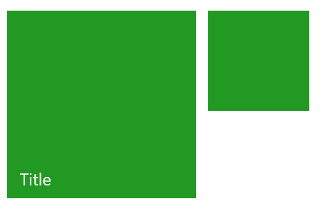
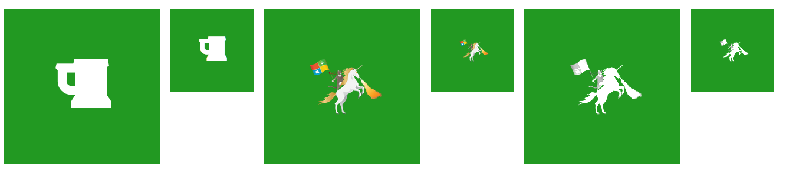
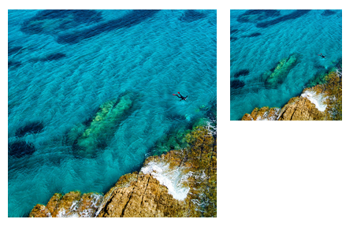
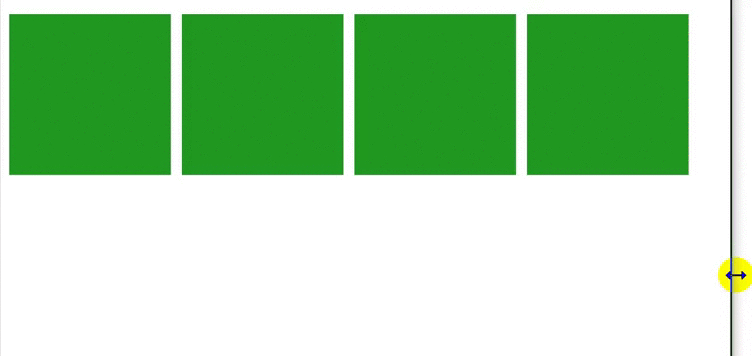

# ModernUI Tiles for the Web
Ever wanted to include the tiles seen in the ModernUI-Design of newer Windows-Versions into your (web)site? Now you can, with minimal effort and plain, vanilla CSS!


## Using It
Just add it as a git-submodule to your project.


## Examples

#### Setting the Backgorund-Color for All Tiles
```html
<head>
	<style type="text/css">
		.tile-big, .tile-small {
			background-color: #229922;
		}
	</style>
</head>
```


#### Basic tiles
```html
<span class="tile-big">
	<p>Title of the tile</p>
</span>
<span class="tile-small">
</span>
```



#### Making the Tiles Clickable
```html
<span class="tile-big">
	<a href="http://google.de"><span></span></a>
	<!-- 						^^ very iomportant 		-->
	<!--						   don't use <span/> !	-->
</span>
```


#### Adding Icons to the Tiles
You can use
+ icons from a CSS-glyphicon-set like [Font-Awesome](https://fortawesome.github.io/Font-Awesome/)
+ image<sup>(e.g. .png)</sup>-files with the help of `class="tile-icon"`
	+ **Hint**: Use something like `style="filter: grayscale(1) brightness(1.75);"` to convert image-files to the "right" look.

```html
<span class="tile-big">
	<i class="fa fa-beer"></i>
</span>
<span class="tile-small">
	<i class="fa fa-beer"></i>
</span>
<span class="tile-big">
	
</span>
<span class="tile-small">
	
</span>
<span class="tile-big">
	
</span>
<span class="tile-small">
	
</span>
```



#### Adding an Image-Background to the Tile
```html
<span class="tile-big">
	
</span>
<span class="tile-small">
   
</span>
```



#### Adding a flexible row
Utilize the power of flexboxes!

```html
<div class="tile-flexrow">
	<span class="tile-big">
	</span>
	<span class="tile-big">
	</span>
	<span class="tile-big">
	</span>
	<span class="tile-big">
	</span>
</div>
```


##### Exclude Groups from wrapping in the FlexRow
```html
<div class="tile-flexrow">
	<span class="tile-big">
	</span>
	<div class="tile-group">
		<span class="tile-big">
		</span>
		<span class="tile-big">
		</span>
	</div>
	<span class="tile-big">
	</span>
</div>
```


#### Group Small Tiles Together
```html
<div class="tile-group-2x2">
	<span class="tile-small">
	</span>
	<span class="tile-small">
	</span>
	<span class="tile-small">
	</span>
</div>
<div class="tile-group-1x2">
	<span class="tile-small">
	</span>
	<span class="tile-small">
	</span>
</div>
```

